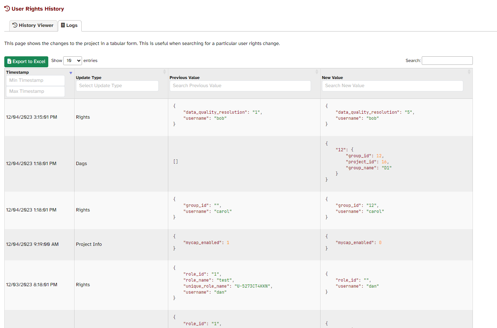

# UserRightsHistory

## Overview
This REDCap External Module allows users to track user access, rights, and permissions in a project over time. 

For example, this image shows the state of the User Rights at one point in time:

whereas this image shows the state of the same project's User Rights on an earlier day:

### History Viewer Page

This is the primary page of the module. It shows a table with the User Rights for each user in the project at the selected time. The time can be changed using the date picker.

### Logging Page

There is a logging table that shows all changes to the User Rights in the project. This table can be disabled in the module's configuration.

## How does it work?

The module runs a cron job every minute. When the module is enabled in a 
project, that project is added to the cron job. An initial snapshot of the User 
Rights is taken, and when changes are made to any aspect of the User Rights in 
that project, another timestamped snapshot is taken. This produces a 
point-in-time history with granularity to the minute. 

### Why not just parse REDCap's logs?

REDCap's logs are insufficient for tracking user rights. Without 100% ground truth at some point, it is impossible to know what state a user's rights are in at any given time. This is in addition to the issues with REDCap's logs not containing all changes to user rights.

## Installation
The module may be installed from the REDCap Repo.                        |

## Configuration

### System-level configuration

None

### Project-level configuration

| Config                                  | Description                                                                                                                                                                                                   |
| --------------------------------------- | ------------------------------------------------------------------------------------------------------------------------------------------------------------------------------------------------------------- |
| Restrict DAG User Display               | If enabled, only users in the same DAG as the current user will be displayed in the User Rights History table.                                                                                                |
| Disable the logging table for all users | Whether to show a table with the module's logs that are used to build the history table. This is useful for searching specific pieces of information.                                                         |
| Restrict Logging for DAG Users          | Whether to remove access to the Logging table for users currently assigned to a DAG.                                                                                                                          |
| Restrict User Access                    | Whether to allow access to the User Rights table for all users or only allow specific users. If selected, a list of the project's users will be shown with the option to allow/disallow access for each user. |

## Changelog

Version descriptions can be found on the [Releases](https://github.com/AndrewPoppe/UserRightsHistory/releases) page.