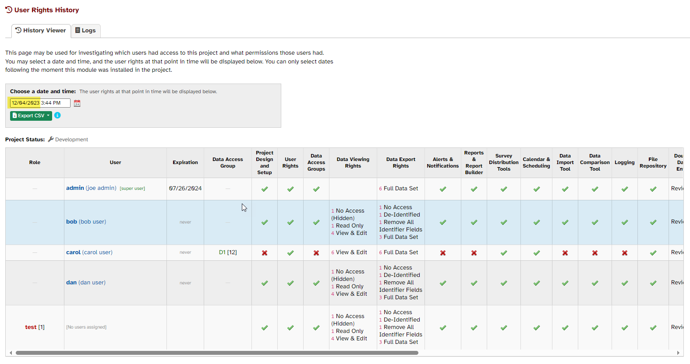
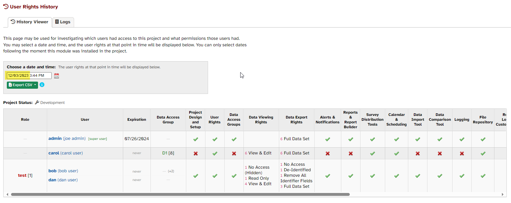

# UserRightsHistory

## Overview
This REDCap External Module allows users to track user access, rights, and permissions in a project over time. 

For example, this image shows the state of the User Rights at one point in time:

whereas this image shows the same project's User Rights several days earlier:

## How does it work?
The module runs a cron job every minute. When the module is enabled in a 
project, that project is added to the cron job. An initial snapshot of the User 
Rights is taken, and when changes are made to any aspect of the User Rights in 
that project, another timestamped snapshot is taken. This produces a 
point-in-time history with granularity to the minute. 

## Installation
The module may be installed from the REDCap Repo.

## Compatibility Table

This table represents informal, real-world use as opposed to systematic functional testing.
Essentially, this table will tell you whether we have confirmed that the module generally
installs and functions correctly given the combination of REDCap and PHP versions.
<table style="text-align:center;">
    <tr>
        <th></th>
        <th colspan="2">REDCap Version</th>
    </tr>
    <tr>
        <th>PHP version</th>
        <th>10.0.28</th>
        <th>12.1.2</th>
    </tr>
    <tr>
        <th>7.3.32</th>
        <td ></td>
        <td></td>
    </tr>
    <tr>
        <th>7.4.5</th>
        <td></td>
        <td></td>
    </tr>
    <tr>
        <th>8.1.3</th>
        <td></td>
        <td></td>
    </tr>
</table>

#### Key
|                    Symbol                    | Meaning                                                                    |
| :------------------------------------------: | :------------------------------------------------------------------------- |
|    | Module installs correctly and seems to function correctly                  |
|  | Module installs correctly but either has not been tested or has minor bugs |
|              | Module fails to install or has major bugs                                  |
|            | No attempt has been made to assess the module                              |
